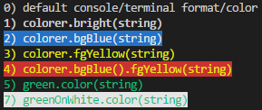

# tty-strings-colorer

### Version: 1.0.0

Colorer for TTY (TeleTYpewriter) Terminal/Console Written Strings

_[tty-strings-colorer](https://github.com/jpbaking/tty-strings-colorer) by [jpbaking](https://github.com/jpbaking)_

## Sample Usage

### Code:
```javascript
console.log(
  '0) default console/terminal format/color')

// BASIC USAGE
const colorer = require('tty-strings-colorer')();
console.log(colorer.bright(
  '1) colorer.bright(string)'));
console.log(colorer.bgBlue(
  '2) colorer.bgBlue(string)'));
console.log(colorer.fgYellow(
  '3) colorer.fgYellow(string)'));
console.log(colorer.bgRed().fgYellow(
  '4) colorer.bgBlue().fgYellow(string)'));

// PRESET
const green = require('tty-strings-colorer')('green');
console.log(green.color(
  '5) green.color(string)'));

const greenOnWhite = require('tty-strings-colorer')('green', 'white');
console.log(greenOnWhite.color(
  '7) greenOnWhite.color(string)'));
```

### Output:

