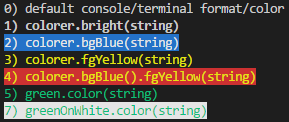

# tty-strings-colorer

> **DEPRECATED**
>
> This package is no longer maintained.
>
> **Limitations:**
>
> - Only ANSI 4-bit color (8 colors) — no extended 16-color, 256-color, or true color (RGB) support.
> - No TTY detection — escape codes are emitted even when stdout is piped to a file, corrupting log files and CI output.
> - No TypeScript types.
> - No "bright" foreground/background color variants, which are standard in most terminals (`bright` here is a text format attribute, not a color modifier).
> - Methods return different types depending on whether a string argument is passed, making the chaining API unintuitive.
>
> **Recommended alternatives:**
>
> | Package | True Color | TTY Detection | TypeScript |
> |---|---|---|---|
> | [chalk](https://github.com/chalk/chalk) | Yes | Yes | Yes |
> | [picocolors](https://github.com/alexeyraspopov/picocolors) | No | Yes | Yes |
> | [kleur](https://github.com/lukeed/kleur) | No | Yes | Yes |
> | [ansi-colors](https://github.com/doowb/ansi-colors) | No | Yes | Yes |
>
> [chalk](https://github.com/chalk/chalk) is the de facto standard and covers everything this package does and more. [picocolors](https://github.com/alexeyraspopov/picocolors) is the go-to when minimal bundle size matters.

### Version: 1.0.1

Colorer for TTY (TeleTYpewriter) Terminal/Console Written Strings

_[tty-strings-colorer](https://github.com/jpbaking/tty-strings-colorer) by [jpbaking](https://github.com/jpbaking)_

## Sample Usage

### Code:
```javascript
console.log(
  '0) default console/terminal format/color')

// BASIC USAGE
const colorer = require('tty-strings-colorer')();
console.log(colorer.bright(
  '1) colorer.bright(string)'));
console.log(colorer.bgBlue(
  '2) colorer.bgBlue(string)'));
console.log(colorer.fgYellow(
  '3) colorer.fgYellow(string)'));
console.log(colorer.bgRed().fgYellow(
  '4) colorer.bgBlue().fgYellow(string)'));

// PRESET
const green = require('tty-strings-colorer')('green');
console.log(green.color(
  '5) green.color(string)'));

const greenOnWhite = require('tty-strings-colorer')('green', 'white');
console.log(greenOnWhite.color(
  '7) greenOnWhite.color(string)'));
```

### Output:

